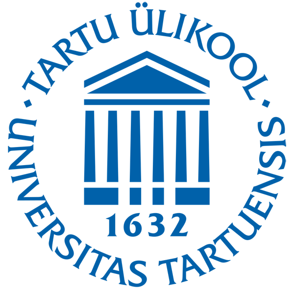

# Metabarcoding: from Lab to Bioinformatics 
University of Tartu, International Summer University, Tartu, 01-05 August, 2022

  
  

https://mycology-microbiology-center.github.io/Metabarcoding2022/

https://ut.ee/en/content/metabarcoding-lab-bioinformatics

High-throughput metabarcoding methods have become a routine analysis tool in biodiversity research and ecology in general. This course will cover the principles of metabarcoding workflow, from the laboratory analyses to bioinformatic analyses of the high-throughput sequencing data.

Laboratory work includes steps for sample preparation, DNA extraction, PCR and sequencing library preparation. The practical sessions are supplemented with theoretical lectures.

Hands-on metabarcoding data set analyses will mostly follow PipeCraft 2 pipeline (user-friendly graphical user interface software for non-bioinformaticians) but basics of command-line interface and usage of high-performance clusters will be also covered.

:estonia::belgium::brazil::cn::croatia::de::indonesia::it::lithuania::mexico::romania::ukraine:

